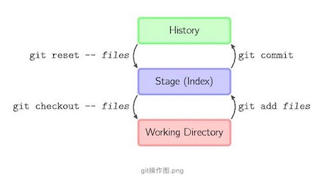
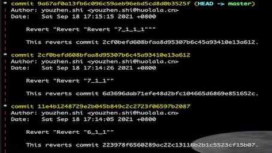
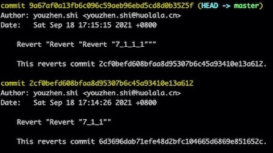
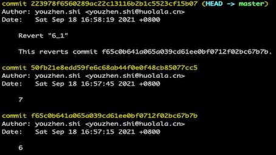

# Git 常用命令理解

Git是一个分布式版本管理系统，是为了更好地管理Linux内核开发而创立的。

### git内部管理模块理解
1、`工作区（working directory`  
2、`暂缓区（stage index`  
3、`历史记录区（history`    
  


### 常用命令
- **git init**  
    * 白话就是初始化仓库，创建一个空的仓库或者重新初始化已经存在的一个git仓库(*Create an empty Git repository or reinitialize an existing one*)

---
- **git clone**  
    * 基础用法：`git clone XXX`，从远程仓库XXX下载代码
    * 添加参数：“git clone --depth=1 仓库地址 --recursive” 与 ”git clone 仓库地址“**区别：**  
    *参数1*：--depth=1代表意思是：克隆代码时只克隆最新的一次提交，即git log 查看日志日只能查看到最新的内容  
    *参数2*：--recursive代表意思是：循环递归克隆仓库的模块（submodule），`git clone XXX --recursive`等同于下面两步操作 
        * git clone；
        * git submodule update --init --recursive  

---
- **git pull**  
    * 基本用法：在仓库根目录执行git pul，从远程仓库拉取新代码
    * 本地有修改时，使用时本地最好stash一下，否则git pull时会自动执行merge（合并）操作，如果本地分支和远程同名分支相同的地方有两个人以上的更改则会有冲突，需要自己解决。    
    * 本地没有修改，会执行fast-forward操作  

---
- **git fetch** 
执行pull，远程数据库的内容就会自动合并。但是，有时只是想确认本地数据库的内容而不想合并。这种情况下，使用fetch

- **git merge**   
- **git branch**
- **git checkout**  
- **git status**  
- **git diff**   
- **git add**  
- **git commit**  
- **git push**  
- **git rebase**   

--- 
- **git log**   
查看提交历史  
用法：git log (--oneline/--graph两个可选参数)  
    * --oneline：简单显示，只有每一次提交的标签信息。如图  
     
    * --graph: 显示分支线信息，以及提交人信息、标签和提交日期   
    
    * --graph: 显示提交人信息、标签和提交日期   
      

    ---  
    !!! note 
    git blame filename 查看该文件每一次的提交信息

---
- **git reset**   
常用参数:hard与soft  
    * hard（修改版本库，修改暂存区，修改工作区）  
    git --hard HEAD～1 (或是版本号)意为将版本库回退1个版本，但是不仅仅是将本地版本库的头指针全部重置到指定版本，也会重置暂存区，并且会将工作区代码也回退到这个版本
    * soft（修改版本库，保留暂存区，保留工作区）  
    git --soft HEAD~1 意为将版本库软回退1个版本，所谓软回退表示将本地版本库的头指针全部重置到指定版本，且将这次提交之后的所有变更都移动到暂存区  

---
- **git revert**  
用法：git revert HEAD~n (HEAD~m) (当前头指针前面第n次（到第m次）)  或者 git revert commit-id
举例：  
    
git log 标签为6的操作是新添加了6.txt文件，标签为7的提交是添加7.txt，然后执行git revert HEAD~1,修改commit标签6_1，则会把标签为6的操作操作删除，删除6.txt

与git reset 区别
```
git reset 是把HEAD向后移动了一下，而git revert是HEAD继续前进，只是新的commit的内容和要revert的内容正好相反，能够抵消要被revert的内容   
git revert与git reset最大的不同是，git revert 仅仅是撤销某次提交，而git reset会将撤销点之后的操作都回退到暂存区中。
1、git revert是用一次新的commit来回滚之前的commit，git reset是直接删除指定的commit。
2、在回滚这一操作上看，效果差不多。但是在日后继续merge以前的老版本时有区别。因为git revert是用一次逆向的commit“中和”之前的提交，因此日后合并老的branch时，导致这部分改变不会再次出现，但是git reset是之间把某些commit在某个branch上删除，因而和老的branch再次merge时，这些被回滚的commit应该还会被引入
```
---
- **git rm**  
类似Linux rm命令，故不常用git rm
```   
git rm --cached readme.txt 只从缓存区中删除readme.txt，保留物理文件  
git rm readme.txt 不但从缓存区中删除，同时删除物理文件  
git mv a.txt b.txt 把a.txt改名为b.txt  
git rm -rf *(目录:递归删除文件)  
```
